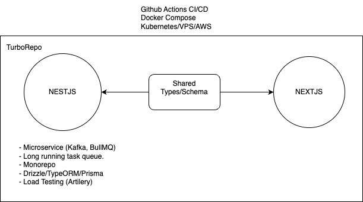

# Fonix App
#### Exploring new dimensions of reality
Project built with [Nextjs v15](https://nextjs.org/) and [Nestjs v10](https://www.nestjs.com/)

## Table of contents
* [Overview](#overview)
* [Features](#features)
* [Getting Started](#getting-started)

## Overview

This project was developed to explore new dimensions of reality.

## Features

This project comes with separate frontend and backend applications. Both apps are monolith applications pre configured with Docker for easy deployment or testing. The project relies on a few core and thrid party library dependencies and was developed from scratch using modern web patterns and the following best practices.
 1. Good developer experience that comes with developing react applications using [Nextjs](https://nextjs.org/).
 2. Good developer experience that comes with developing server applications using [Nestjs](https://www.nestjs.com/).
 3. Easy local deployment of both frontend and backend applications with [Docker-compose](https://docs.docker.com/compose/).

## Getting Started

### Local Setup with Node
Ensure you have Nodejs installed locally. Setup either app by running
`npm run dev` commands in your terminal.

### Setup with Docker
Ensure you have Docker installed locally. Setup either app by running
 `docker-copose up --build` command in your terminal. This should start both apps.

Finally, navigate to `http://localhost:3000/` in your browser to view the frontend application. The api server runs on the default Nestjs port 8000.
